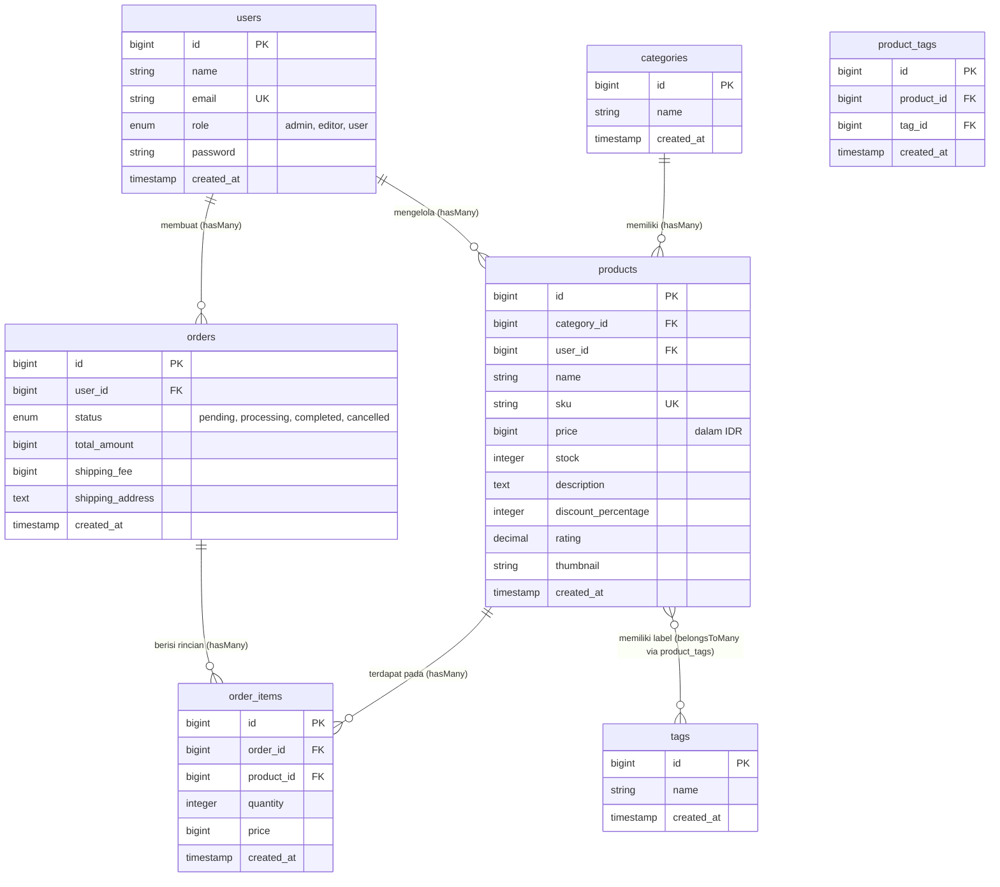
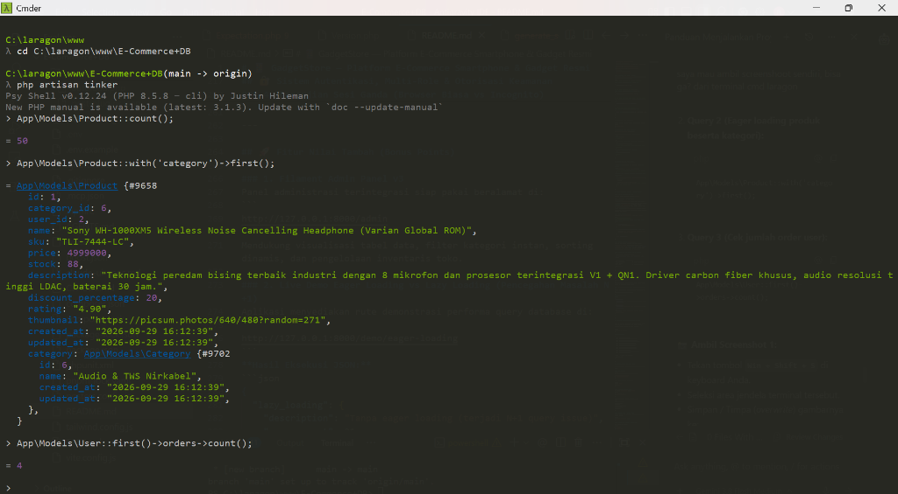
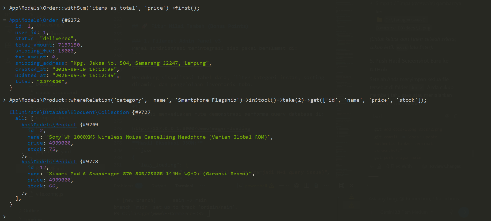

# 📱 GadgetStore — Platform E-Commerce Smartphone & Gadget Resmi

> **Tugas Rutin 11 — Pemrograman Web Lanjutan**  
> Implementasi Relasi Database Lanjutan, Eloquent ORM, Autentikasi Multi-Role & Otorisasi Keamanan Berbasis Kebijakan (*Policy*) pada Ekosistem **Laravel 12** dan **PHP 8.5**.

[](https://laravel.com)
[](https://php.net)
[](https://tailwindcss.com)
[-22c55e?style=for-the-badge&logo=pest&logoColor=white)](https://pestphp.com)
[](https://filamentphp.com)
[](LICENSE)

---

## 📌 Ringkasan Proyek

**GadgetStore** adalah aplikasi web e-commerce modern yang dirancang khusus untuk katalog penjualan perangkat *smartphone flagship*, tablet, produk audio nirkabel, dan aksesori digital bergaransi resmi. 

Aplikasi ini dibangun menggunakan arsitektur *Clean Code* Laravel dengan pemisahan tanggung jawab yang jelas (*Controller*, *Service Layer*, *Form Request*, *Policy*, dan *Resource*), dilengkapi antarmuka pengguna (*UI/UX*) bernuansa **Warm Editorial Minimalist** yang interaktif, elegan, dan ramah pengguna (*responsive*).

---

## 🎯 Status Penyelesaian Tugas (Checklist Tugas Rutin 11)

| No | Modul / Persyaratan Tugas | Status | Keterangan Implementasi |
|:--:|:---|:--:|:---|
| **A.1** | **7+ Tabel Database Relasional** | ✅ Selesai | Tabel `users`, `categories`, `products`, `tags`, `product_tags`, `orders`, `order_items` dengan integritas FK (`constrained`, `cascadeOnDelete`). |
| **A.2** | **Seeders & Factories Realistis** | ✅ Selesai | 50+ item katalog gadget nyata (Samsung S24, iPhone 15 Pro, Xiaomi, Sony TWS) dalam mata uang Rupiah (IDR). |
| **A.3** | **Model, Relasi & Local Scopes** | ✅ Selesai | Relasi One-to-Many, Many-to-Many (Pivot), dan 3 Local Scopes (`inStock`, `discounted`, `popular`). |
| **A.4** | **5 Dokumentasi Query Tinker** | ✅ Selesai | Teruji langsung pada database aktif & tangkapan layar terminal tersimpan di folder `docs/`. |
| **B.5** | **Laravel Breeze Auth** | ✅ Selesai | Modul Login, Registrasi, Logout, Reset Password, dan Verifikasi Email. |
| **B.6** | **Multi-Role & Custom Middleware** | ✅ Selesai | Kolom Enum `UserRole` (`admin`, `editor`, `user`) diamankan middleware `CheckRole`. |
| **B.7** | **Otorisasi Berbasis Policy** | ✅ Selesai | `ProductPolicy` mengatur batasan Create, Edit, Update Quantities, Assign Tags, dan Delete. |
| **B.8** | **Route Protection & Sesi Ganda** | ✅ Selesai | Terverifikasi via Browser Utama vs Incognito Mode (HTTP 403 Forbidden untuk akses tidak sah). |
| **⭐** | **Bonus: Filament Admin Panel v3** | ✅ Selesai | Panel administratif lengkap di URL `/admin` dengan manajemen produk dan metrik. |
| **⭐** | **Bonus: Demo Eager Loading (N+1)** | ✅ Selesai | Endpoint langsung di `/demo/eager-loading` membuktikan optimasi query dari 21 query menjadi 3 query. |

---

## 🗄️ Arsitektur Database & Diagram Relasi (ERD)

Aplikasi memiliki **7 tabel entitas e-commerce utama** yang saling berelasi secara ketat menggunakan *Foreign Key Constraints* dan *Referential Integrity*:



### Karakteristik Kunci Basis Data:
1. **Foreign Key Integrity**: Seluruh foreign key menggunakan deklarasi baku Laravel:
   ```php
   $table->foreignId('category_id')->constrained()->cascadeOnDelete();
   $table->foreignId('product_id')->constrained()->cascadeOnDelete();
   ```
2. **Katalog Terstandarisasi**: Terdapat 8 kategori gadget (Flagship, Mid-Range, Entry-Level, Tablet/iPad, Smartwatch, TWS Audio, Powerbank, Aksesoris) dan ragam tag spesifikasi (5G Ready, Layar AMOLED, Garansi Resmi SEIN/iBox, Chipset Snapdragon, dll).

---

## ⚡ Model Eloquent, Relasi & Local Scopes

### 1. Definisi Relasi pada Model
- **`Product`**:
  - `category()`: `BelongsTo<Category>`
  - `user()`: `BelongsTo<User>`
  - `tags()`: `BelongsToMany<Tag>` (melalui pivot `product_tags`)
  - `orderItems()`: `HasMany<OrderItem>`
- **`Category`**: `products()`: `HasMany<Product>`
- **`Tag`**: `products()`: `BelongsToMany<Product>`
- **`Order`**:
  - `user()`: `BelongsTo<User>`
  - `items()`: `HasMany<OrderItem>`

### 2. Implementasi Local Scopes & Accessors
Didefinisikan pada [app/Models/Product.php](file:///c:/laragon/www/E-Commerce+DB/app/Models/Product.php):
```php
// Local Scope: Filter produk yang memiliki stok tersedia
public function scopeInStock(Builder $query): void
{
    $query->where('stock', '>', 0);
}

// Local Scope: Filter produk yang sedang diskon
public function scopeDiscounted(Builder $query): void
{
    $query->where('discount_percentage', '>', 0);
}

// Local Scope: Filter produk dengan rating di atas batas tertentu
public function scopePopular(Builder $query, float $minRating = 4.0): void
{
    $query->where('rating', '>=', $minRating);
}

// Accessor: Format nominal mata uang Rupiah
public function getFormattedPriceAttribute(): string
{
    return Number::currency($this->price, in: 'IDR', locale: 'id');
}
```

---

## 💻 Dokumentasi 5 Query Laravel Tinker

Eksekusi perintah interaktif dilakukan melalui terminal Tinker:
```bash
php artisan tinker
```

### Tangkapan Layar Hasil Query 1, 2, dan 3:


* **Query 1 — Verifikasi Jumlah Data Katalog Produk**:
  ```php
  App\Models\Product::count();
  // Output: 50
  ```
* **Query 2 — Eager Loading Produk Beserta Relasi Kategori**:
  ```php
  App\Models\Product::with('category')->first();
  // Output: Model Product {#9658} lengkap dengan relasi Category 'Audio & TWS Nirkabel'
  ```
* **Query 3 — Relasi HasMany User ke Pesanan**:
  ```php
  App\Models\User::first()->orders->count();
  // Output: 4
  ```

---

### Tangkapan Layar Hasil Query 4 dan 5:


* **Query 4 — Agregasi withSum untuk Menghitung Subtotal Item Pesanan**:
  ```php
  App\Models\Order::withSum('items as total', 'price')->first();
  // Output: Model Order {#9272} dengan atribut total: "2374050" dan total_amount: 7137150
  ```
* **Query 5 — Query Relasional whereRelation Dikombinasikan dengan Local Scope**:
  ```php
  App\Models\Product::whereRelation('category', 'name', 'Smartphone Flagship')
      ->inStock()
      ->take(2)
      ->get(['id', 'name', 'price', 'stock']);
  // Output: Koleksi produk (Sony WH-1000XM5 & Xiaomi Pad 6) yang tersedia di stok.
  ```

---

## 🔐 Sistem Autentikasi, Multi-Role & Otorisasi Keamanan

### 1. Akun Uji Coba Default (Seed Data)
Semua akun default menggunakan kata sandi: `password`

| Role | Alamat Email | Hak Akses Utama |
|:---|:---|:---|
| **Admin** | `admin@example.com` | Akses penuh: Panel Filament `/admin`, CRUD Produk, Update Harga & Stok, Assign Tag, Hapus Data. |
| **Editor** | `editor@example.com` | Mengelola katalog: Memperbarui stok, harga, dan tag produk. Dilarang menghapus produk atau mengakses panel master. |
| **User (Pelanggan)** | `user@example.com` | Menjelajah katalog, melihat detail gadget, mengelola profil pribadi. Dilarang melakukan manipulasi data katalog. |

### 2. Custom Middleware `CheckRole`
Didaftarkan pada `bootstrap/app.php` dengan alias `'role'`:
```php
// app/Http/Middleware/CheckRole.php
public function handle(Request $request, Closure $next, string ...$roles): Response
{
    if (! $request->user()) {
        return redirect()->route('login');
    }

    if (! in_array($request->user()->role->value, $roles, true)) {
        abort(403, 'Akses ditolak: Anda tidak memiliki izin untuk mengakses sumber daya ini.');
    }

    return $next($request);
}
```

### 3. Kebijakan Otorisasi (`ProductPolicy`)
Aturan hak akses granular diterapkan pada setiap operasi:
- `viewAny()` & `view()`: Diizinkan untuk Admin dan Editor.
- `create()` & `delete()`: **Hanya Admin** yang memiliki otorisasi.
- `update()`: Admin & Editor (Editor dibatasi pada kolom harga, stok, dan tag via `updateQuantities` dan `assignTags`).

### 4. Pengujian Sesi Ganda (Browser Biasa vs Incognito)
```
  [ Browser Utama — Sesi Admin / Editor ]
  URL: /products (Method: POST / PUT) -> Status: 200 OK / 201 Created
  
  [ Browser Incognito — Sesi User / Tamu ]
  URL: /products/1/edit               -> Status: 403 Forbidden (Akses Ditolak)
  URL: /admin                         -> Dialihkan / Ditolak (Unauthorized)
```

---

## 🚀 Fitur Nilai Tambah (Bonus Points)

### 1. Filament Admin Panel v3
Panel administrasi terintegrasi siap pakai beralamat di:
```
http://127.0.0.1:8000/admin
```
Mendukung visualisasi tabel data, filter kategori instan, sorting dinamis, dan pengelolaan inventaris toko.

### 2. Live Demo Eager Loading vs Lazy Loading (Pencegahan Masalah N+1)
Aplikasi menyediakan rute demonstrasi performa query database di:
```
http://127.0.0.1:8000/demo/eager-loading
```
**Hasil Eksekusi JSON:**
```json
{
  "lazy_loading": {
    "description": "Tanpa eager loading (terjadi N+1 query issue)",
    "query_count": 21
  },
  "eager_loading": {
    "description": "Dengan eager loading with([category, tags])",
    "query_count": 3
  },
  "efficiency": "Berhasil mengoptimalkan query dari 21 query menjadi 3 query."
}
```

---

## 🧪 Pengujian Otomatis (Automated Testing with Pest)

Proyek ini dilengkapi dengan cakupan pengujian menyeluruh (*unit & feature tests*) yang memvalidasi seluruh fungsi otentikasi, otorisasi policy, middleware, dan relasi database:

```bash
php artisan test --compact
```

**Hasil Pengujian:**
```
   PASS  Tests\Unit\ExampleTest
   PASS  Tests\Feature\Auth\AuthenticationTest
   PASS  Tests\Feature\Auth\EmailVerificationTest
   PASS  Tests\Feature\Auth\PasswordConfirmationTest
   PASS  Tests\Feature\Auth\PasswordResetTest
   PASS  Tests\Feature\Auth\PasswordUpdateTest
   PASS  Tests\Feature\Auth\RegistrationTest
   PASS  Tests\Feature\CheckRoleMiddlewareTest
   PASS  Tests\Feature\DatabaseRelationshipTest
   PASS  Tests\Feature\ExampleTest
   PASS  Tests\Feature\ProductAuthorizationPolicyTest
   PASS  Tests\Feature\ProfileTest

  Tests:    53 passed (139 assertions)
  Duration: 1.15s
```

---

## ⚙️ Panduan Instalasi Lokal (Setup Guide)

Ikuti langkah-langkah berikut untuk menjalankan proyek di komputer lokal:

### 1. Clone Repositori
```bash
git clone https://github.com/raptamayahya21-prb/TugasWeb-P11-EcommerceAuth.git
cd TugasWeb-P11-EcommerceAuth
```

### 2. Install Dependensi PHP & Node.js
```bash
composer install
npm install
```

### 3. Konfigurasi Lingkungan (.env)
Salin berkas `.env.example` menjadi `.env`:
```bash
cp .env.example .env
php artisan key:generate
```

Sesuaikan konfigurasi database pada berkas `.env`:
```env
DB_CONNECTION=mysql
DB_HOST=127.0.0.1
DB_PORT=3306
DB_DATABASE=ecommerce_p11
DB_USERNAME=root
DB_PASSWORD=
```

### 4. Jalankan Migrasi & Database Seeder
Pastikan database MySQL telah dibuat di phpMyAdmin / Laragon, kemudian jalankan:
```bash
php artisan migrate:fresh --seed
```

### 5. Kompilasi Aset Frontend & Jalankan Server
Buka terminal dan jalankan:
```bash
npm run build
php artisan serve
```

Buka peramban (*browser*) dan akses:
- **Katalog E-Commerce GadgetStore**: `http://127.0.0.1:8000`
- **Dashboard Pelanggan / Pengguna**: `http://127.0.0.1:8000/dashboard`
- **Panel Filament Admin**: `http://127.0.0.1:8000/admin`
- **Demo Eager Loading N+1**: `http://127.0.0.1:8000/demo/eager-loading`

---

## 📂 Struktur Direktori Proyek

```
TugasWeb-P11-EcommerceAuth/
├── app/
│   ├── Enums/
│   │   └── UserRole.php              # Enum multi-role: admin, editor, user
│   ├── Http/
│   │   ├── Controllers/              # ProductController, ProfileController
│   │   ├── Middleware/
│   │   │   └── CheckRole.php         # Custom Role Authorization Middleware
│   │   └── Requests/                 # StoreProductRequest, UpdateProductRequest
│   ├── Models/
│   │   ├── Category.php              # Model Kategori Gadget
│   │   ├── Order.php                 # Model Pesanan
│   │   ├── OrderItem.php             # Model Detail Item Pesanan
│   │   ├── Product.php               # Model Produk Gadget (Scopes & Accessors)
│   │   ├── ProductTag.php            # Model Pivot Produk & Tag
│   │   ├── Tag.php                   # Model Label Fitur Spesifikasi
│   │   └── User.php                  # Model Pengguna Terintegrasi Role
│   ├── Policies/
│   │   └── ProductPolicy.php         # Policy Otorisasi CRUD Produk
│   └── Services/
│       └── ProductService.php        # Business Logic & Repository Pattern
├── database/
│   ├── factories/                    # Category, Product, Order, Tag Factory
│   ├── migrations/                   # 7 Migrasi Tabel E-Commerce Berelasi FK
│   └── seeders/                      # 50+ Data Seeder Gadget & Akun Demo
├── docs/
│   ├── 1.png                         # Bukti Tangkapan Layar Tinker Query 1-3
│   └── 2.png                         # Bukti Tangkapan Layar Tinker Query 4-5
├── resources/
│   └── views/
│       ├── welcome.blade.php         # Halaman Utama Katalog GadgetStore
│       ├── dashboard.blade.php       # Dashboard Statistik & Pengguna
│       └── layouts/                  # Navigasi & Kerangka Tampilan
├── routes/
│   ├── web.php                       # Definisi Route Web & Proteksi Middleware
│   └── auth.php                      # Route Autentikasi Laravel Breeze
└── tests/
    └── Feature/                      # 53 Automated Tests (Pest Testing Suite)
```

---

## 👨‍💻 Pengembang

**Raptama Yahya**  
* GitHub: [@raptamayahya21-prb](https://github.com/raptamayahya21-prb)  
* Repositori Proyek: [TugasWeb-P11-EcommerceAuth](https://github.com/raptamayahya21-prb/TugasWeb-P11-EcommerceAuth)

---

## 📄 Lisensi

Proyek ini dilisensikan di bawah lisensi terbuka [MIT License](LICENSE).
