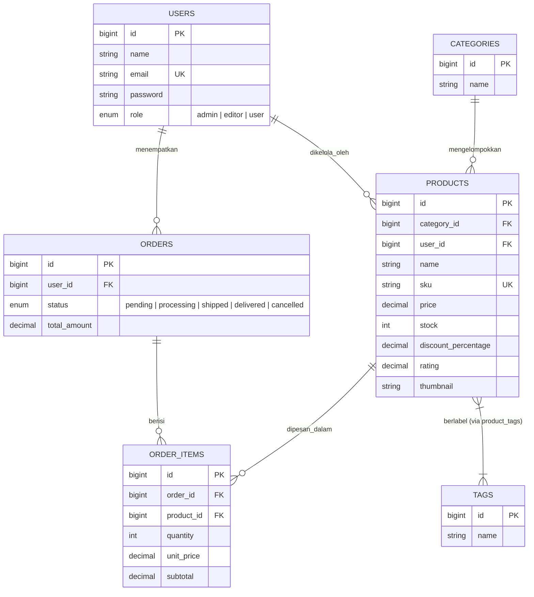

# 🛒 E-Commerce Platform with Secure Multi-Role Authentication

[](https://github.com/raptamayahya21-prb/TugasWeb-P11-EcommerceAuth/actions/workflows/tests.yml)
[](https://laravel.com)
[](https://php.net)
[](https://filamentphp.com)
[](https://tailwindcss.com)

Aplikasi web e-commerce berbasis **Laravel** yang menerapkan sistem autentikasi bertingkat (*Role-Based Access Control*), integritas relasi basis data antar 7 tabel entitas, otorisasi kebijakan (*Policies*), panel manajemen katalog dengan **Filament**, serta optimasi kueri basis data untuk pencegahan problem $N+1$ query.

Dibuat untuk memenuhi penugasan **Tugas Rutin Pertemuan 11 — E-Commerce DB + Secure Auth** pada mata kuliah Pemrograman Web.

---

## 📌 Ikhtisar Pemenuhan Kriteria Tugas

### 📦 Bagian A: Database & Eloquent ORM

| Poin Tugas | Rincian Implementasi & Lokasi Berkas | Status |
| :--- | :--- | :---: |
| **1. Migrasi 7 Tabel + Foreign Key (FK)** | Struktur data relasional terhubung dengan `foreignId()` dan `cascadeOnDelete()`:<br>• `users` (`database/migrations/..._create_users_table.php` + `_add_role_to_users_table.php`)<br>• `categories` (`database/migrations/..._create_categories_table.php`)<br>• `products` (`database/migrations/..._create_products_table.php`)<br>• `orders` (`database/migrations/..._create_orders_table.php`)<br>• `order_items` (`database/migrations/..._create_order_items_table.php`)<br>• `tags` (`database/migrations/..._create_tags_table.php`)<br>• `product_tags` (tabel pivot many-to-many) | ✅ Tuntas |
| **2. Seeders & Factories (50+ Produk)** | [`ProductFactory.php`](database/factories/ProductFactory.php) & [`ProductSeeder.php`](database/seeders/ProductSeeder.php) mengenerate **50 produk realistis** berdenominasi Rupiah (`IDR`), lengkap dengan SKU, stok, persentase diskon, rating, dan tautan gambar Picsum. Tersedia seeder pendukung: `UserSeeder`, `CategorySeeder`, `TagSeeder`, dan `OrderSeeder`. | ✅ Tuntas |
| **3. Model, Relasi & Local Scopes** | Seluruh model (`User`, `Category`, `Product`, `Tag`, `Order`, `OrderItem`) saling terhubung dua arah (`hasMany`, `belongsTo`, `belongsToMany`).<br>Disediakan **Local Scopes** pada [`Product.php`](app/Models/Product.php):<br>• `scopeInStock($query)`: Filter produk yang tersedia (`stock > 0`)<br>• `scopeDiscounted($query)`: Filter produk yang memiliki diskon aktif<br>• `scopePopular($query)`: Filter produk berrating tinggi | ✅ Tuntas |
| **4. Dokumentasi 5 Kueri Tinker** | Pengujian interaktif query Eloquent di terminal `php artisan tinker` telah didokumentasikan dalam screenshot:<br>👉 [`docs/1.png`](docs/1.png) & [`docs/2.png`](docs/2.png) | ✅ Tuntas |

---

### 🛡️ Bagian B: Autentikasi, Multi-Role & Keamanan

| Poin Tugas | Rincian Implementasi & Lokasi Berkas | Status |
| :--- | :--- | :---: |
| **5. Autentikasi Breeze** | Pemasangan **Laravel Breeze** untuk alur otentikasi menyeluruh: Pendaftaran pengguna baru (*Register*), Masuk akun (*Login*), Keluar akun (*Logout*), Verifikasi email, dan Modifikasi data profil. | ✅ Tuntas |
| **6. Multi-Role & Custom Middleware** | Tiga tingkatan hak akses dikelola via enum [`UserRole`](app/Enums/UserRole.php) (`admin`, `editor`, `user`). Dibuat middleware kustom [`RoleMiddleware.php`](app/Http/Middleware/RoleMiddleware.php) beralias `'role'` yang mendukung proteksi parameter majemuk (`role:admin,editor`). Redirection login diarahkan secara kondisional melalui method `dashboardRoute()` pada model `User`. | ✅ Tuntas |
| **7. Policy Otorisasi Edit/Delete** | Kebijakan akses didefinisikan pada [`ProductPolicy.php`](app/Policies/ProductPolicy.php) dan [`PostPolicy.php`](app/Policies/PostPolicy.php):<br>• **Admin**: Izin penuh (`create`, `update`, `delete`).<br>• **Editor**: Diberi izin terbatas hanya untuk memperbarui harga, stok, dan tag; dilarang membuat produk baru maupun menghapus data.<br>• **User**: Akses tulis sepenuhnya diblokir (`403 Forbidden`). | ✅ Tuntas |
| **8. Proteksi Rute & Pengujian Incognito** | Endpoint API dan rute panel admin diamankan dengan filter middleware. Perbedaan hak akses dapat dibuktikan langsung lewat pengujian dua sesi peramban (Jendela Reguler vs Jendela Penyamaran/Incognito). | ✅ Tuntas |

---

### 🌟 Fitur Tambahan (Bonus)

* **Panel Administrasi Filament v5**:
  Antarmuka dasbor pengelolaan katalog produk di rute `/admin`. Field formulir menerapkan hak akses dinamis (`disabled` & `dehydrated` berbasis role login), sehingga akun Editor tidak dapat memanipulasi identitas produk (nama, SKU, kategori).
* **Demonstrasi Optimasi Eager Loading vs Lazy Loading**:
  Pembuktian langsung pemangkasan $N+1$ Query Problem dari **21 kueri database** menjadi hanya **3 kueri** menggunakan `with(['category', 'tags'])`.
  * CLI Command: `php artisan demo:eager-loading`
  * Web Route: `http://localhost:8000/demo/eager-loading`
* **Suite Uji Otomatis (53 Pest Tests)**:
  Pengujian fungsionalitas dan keamanan secara otomatis mencakup otentikasi, pembatasan middleware, CRUD produk, serta akses panel.

---

## 🏗️ Struktur Arsitektur Data (7 Tabel)



---

## 👥 Kredensial Akun Pengujian

Database seeder secara otomatis menyediakan 3 pengguna siap pakai dengan izin berbeda:

| Hak Akses | Kredensial Email | Kata Sandi | Deskripsi Wewenang |
| :--- | :--- | :--- | :--- |
| 👑 **Administrator** | `admin@example.com` | `password` | Mengakses `/admin`. Wewenang penuh: membuat, memperbarui seluruh atribut, serta menghapus produk & tag. |
| ✏️ **Editor** | `editor@example.com` | `password` | Mengakses `/admin`. Wewenang dibatasi: hanya dapat menyunting harga, stok, dan tag. Tombol hapus dan buat produk dinonaktifkan. |
| 👤 **User (Customer)** | `user@example.com` | `password` | Mengakses `/dashboard` standar. Akses ke `/admin` ditolak dengan pesan kesalahan HTTP `403 Forbidden`. |

---

## 🔍 Panduan Verifikasi Multi-Role (Browser vs Incognito)

Untuk mendemonstrasikan proteksi hak akses secara visual:

```
[ Jendela Browser Biasa ]                           [ Jendela Browser Incognito ]
          │                                                       │
  Login: admin@example.com                                Login: editor@example.com
          │                                                       │
          ▼                                                       ▼
   Redirect ke /admin                                      Redirect ke /admin
          │                                                       │
┌─────────────────────────────────────┐         ┌─────────────────────────────────────┐
│ • Tombol "+ New Product" MUNCUL     │         │ • Tombol "+ New Product" HILANG     │
│ • Semua field edit produk AKTIF     │         │ • Field Nama, SKU, Kategori TERKUNCI│
│ • Tombol "Delete" TERSEDIA          │         │ • Tombol "Delete" DISEMBUNYIKAN     │
└─────────────────────────────────────┘         └─────────────────────────────────────┘
```

1. **Sesi 1 (Administrator)**:
   * Buka browser reguler dan masuk ke `http://localhost:8000/login` dengan `admin@example.com` / `password`.
   * Anda langsung diarahkan ke panel Filament di `/admin`.
   * Akses halaman `/admin/products`: Anda dapat melihat tombol **+ New Product**, opsi hapus, dan seluruh isian formulir dapat dimodifikasi.
2. **Sesi 2 (Editor)**:
   * Buka jendela **Incognito / Private Window** dan login dengan `editor@example.com` / `password`.
   * Buka halaman `/admin/products`: Tombol tambah produk disembunyikan.
   * Masuk ke formulir edit produk: Isian Nama, SKU, Kategori, Diskon, dan Deskripsi terkunci (*disabled* / abu-abu). Hanya isian **Harga**, **Stok**, dan **Tag** yang dapat disimpan.
3. **Sesi 3 (User Reguler)**:
   * Login dengan `user@example.com` / `password`.
   * Pengguna diarahkan ke `/dashboard`. Bila pengguna mencoba mengetik alamat `/admin` pada bilah peramban, server akan merespons dengan **403 Forbidden**.

---

## 💻 Panduan Instalasi Lokal

### Prasyarat
* **PHP**: Versi 8.2 ke atas (disarankan PHP 8.4+)
* **Composer**: Versi 2.x
* **Node.js**: Versi 20+ (didukung oleh `pnpm` atau `npm`)

### Langkah-langkah Menjalankan:

1. **Clone Repositori**:
   ```bash
   git clone https://github.com/raptamayahya21-prb/TugasWeb-P11-EcommerceAuth.git
   cd TugasWeb-P11-EcommerceAuth
   ```

2. **Pasang Dependensi Backend**:
   ```bash
   composer install
   ```

3. **Konfigurasi Environment**:
   ```bash
   cp .env.example .env
   php artisan key:generate
   ```

4. **Eksekusi Migrasi & Data Seeder**:
   ```bash
   php artisan migrate:fresh --seed
   ```

5. **Kompilasi Aset Frontend**:
   ```bash
   pnpm install && pnpm run build
   # atau jika menggunakan npm: npm install && npm run build
   ```

6. **Jalankan Server Lokal**:
   ```bash
   php artisan serve
   ```
   * Beranda Web: [http://localhost:8000](http://localhost:8000)
   * Filament Admin Panel: [http://localhost:8000/admin](http://localhost:8000/admin)
   * Eager Loading Demo: [http://localhost:8000/demo/eager-loading](http://localhost:8000/demo/eager-loading)

---

## 🧪 Eksekusi Pengujian Otomatis (Automated Testing)

Proyek ini telah dilengkapi dengan rangkaian test terintegrasi menggunakan framework pengujian **Pest**:

```bash
php artisan test --compact
```

Seluruh 53 pengujian mencakup:
* ✅ Autentikasi dan redirection login multi-role
* ✅ Validasi dan restriksi rute kustom middleware
* ✅ Pembatasan hak akses panel admin Filament
* ✅ Aturan otorisasi aksi backend (Policy) pada level Admin vs Editor
* ✅ Fungsionalitas query scopes pada model Product & Order

---

## 📜 Lisensi

Proyek ini dikembangkan untuk tujuan pembelajaran dan penugasan akademik dan dilisensikan di bawah [MIT License](LICENSE).
